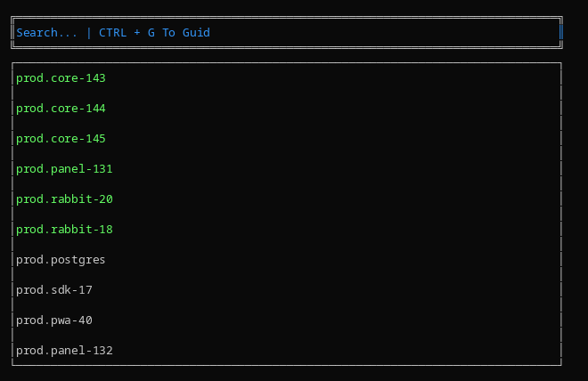

# ssht


**ssht** or **ssh-tmux**.
As a DevOps engineer, every day i used to
open a *tmux*, create many *panes* and in each of pane i *ssh*
to a host then i set `syncronize-pane on` to use all the
panes at once.

Then I get familiar with [sshs](https://terminaltrove.com/feed/sshs/)
tool. it's just a TUI over
[*ssh_config*](https://man.freebsd.org/cgi/man.cgi?query=ssh_config&sektion=5&manpath=OpenBSD+3.4) file, which let you
search and connect to your ssh host.

I combine this two idea, which the result came out
with `ssht`, a TUI that let you search between your ssh hosts 
and then open all the hosts that you searched
in a tmux session. or you can connect to one host.

### Features
- searchable (case-insensitive substring match over your ssh hosts)
- ssh in a tmux session (tailed panes, synced panes, or separate windows)
- connect directly to a single host without tmux
- shows each host's configured IP (`HostName`) next to its name
- use red and green color for reachable or unreachable hosts
- live reachability check that refreshes as you search, running up to 22 hosts in parallel so big lists stay fast

### Installation
To install or update to the latest version of `ssht`, run the following command in your terminal:
```bash
curl -sSL https://raw.githubusercontent.com/shabane/ssht/master/install.sh | bash
```
This script will automatically detect your OS/architecture, download the correct latest release from GitHub, and install it to `~/.local/bin/ssht`.

### shortcuts
|  Key   |                       Task                       |
|:------:|:------------------------------------------------:|
| CTRL+G |                 Open Guide Menu                  |
| CTRL+W | Connect Directly to Selected Host (No Tmux)      |
| CTRL+A |         Open All Searched Hosts in tmux          |
| CTRL+O | Open All Searched Hosts With Synced Pane In tmux |
| CTRL+N |  Open All Searched Hosts In New Window On tmux   |
| CTRL+C |                       Quit                       |
|  Esc   |                       Back                       |

### Demos

#### 1. Connect to Single Host (Press `Enter` / `CTRL+W` for Direct)


#### 2. Connect to All (Tailed Mode - `CTRL+A`)


#### 3. Connect to All with Synced Panes (`CTRL+O`)


#### 4. Connect to All in New Windows (`CTRL+N`)


---

> I guaranty that its work on my machine.